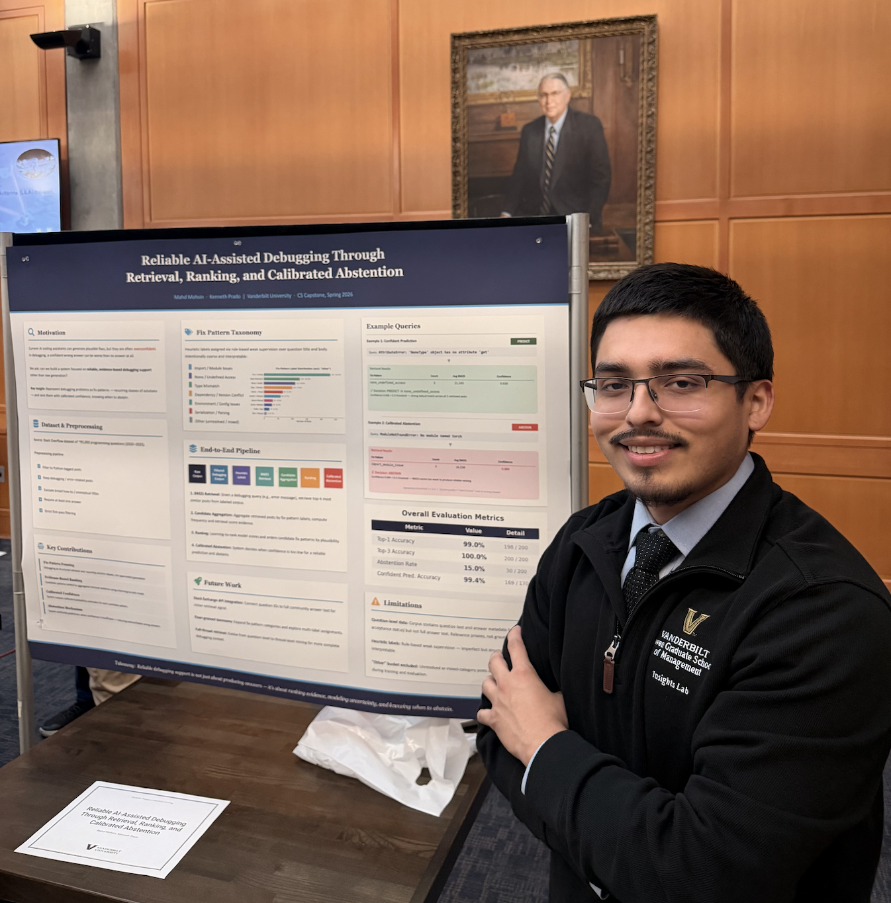

# Hi, my name is Kenneth 👋
I'm a recent Computer Science and Mathematics graduate from Vanderbilt and I'm pursuing my Master's in Data Science—expected to graduate in May 2027. 

My experience spans data analytics, program coordination, and community leadership. I enjoy translating data and emerging technologies into insights that support better decisions, improve systems, and create more meaningful experiences for people and organizations.

I'm currently interested in:
- 🤖 Artificial Intelligence & Machine Learning
- 📊 Data Science & Analytics
- 🔗 Agentic Workflows & Agent-Based Pipelines

## 🛠 Tech Stack

### Languages

### Tools

## 🚀 Featured Project

### [Reliable Debugging Assistant](https://github.com/kennypra/Debugging-Assistant)
An AI-assisted debugging system that goes beyond typical code-generation assistants — it retrieves relevant Stack Overflow discussions, ranks likely fix patterns using a learning-to-rank model, and returns a **calibrated confidence score**, abstaining when it isn't confident enough to give reliable advice. Built a 6-stage pipeline (preprocessing → labeling → BM25 retrieval → synthetic training data → pointwise ranking → calibration) over a corpus of 95K+ Stack Overflow posts.

**Tech:** Python · scikit-learn · BM25 · Logistic Regression · Platt Scaling

  
   
  <em>Presenting the Debugging Assistant project at Vanderbilt's CS Immersion Symposium</em>

## 📊 GitHub Stats

  

---

## 🌎 Let's Connect!
- LinkedIn: https://linkedin.com/in/kenneth-c-prado
- Email: kenneth.c.prado@vanderbilt.edu

---

> "Always learning. Always building."
